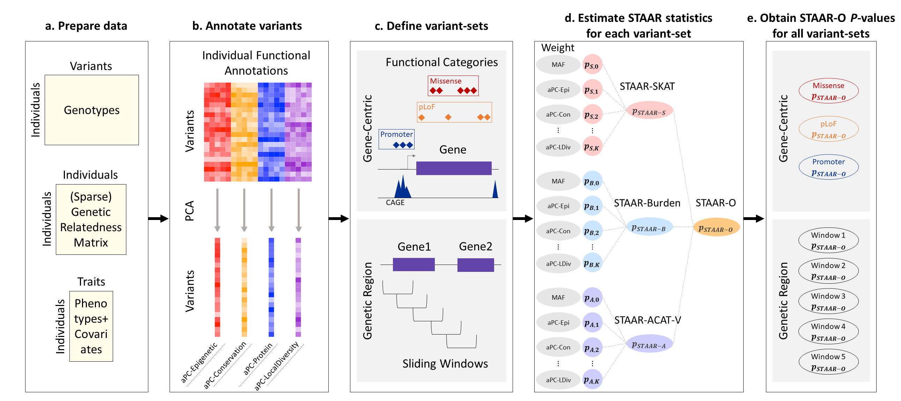

[](https://github.com/xihaoli/STAAR)
[](https://travis-ci.com/xihaoli/STAAR)
[](https://ci.appveyor.com/project/xihaoli/STAAR)
[](https://www.gnu.org/licenses/gpl-3.0)

# STAAR (variant-Set Test for Association using Annotation infoRmation)
This is an R package for performing STAAR procedure in whole-genome sequencing studies.
## Description
STAAR is an R package for performing variant-Set Test for Association using Annotation infoRmation (STAAR) procedure in whole-genome sequencing (WGS) studies. STAAR is a general framework that incorporates both qualitative functional categories and quantitative complementary functional annotations using an omnibus multi-dimensional weighting scheme. STAAR accounts for population structure and relatedness, and is scalable for analyzing large WGS studies of continuous and dichotomous traits.
## Workflow Overview

## Prerequisites
<a href="https://www.r-project.org">R</a> (recommended version >= 3.4.2)

For optimal computational performance, it is recommended to use an R version configured with the Intel Math Kernel Library (or other fast BLAS/LAPACK libraries). See the <a href="https://software.intel.com/en-us/articles/using-intel-mkl-with-r">instructions</a> on building R with Intel MKL.
## Dependencies
STAAR links to R packages <a href="https://cran.r-project.org/web/packages/Rcpp/index.html">Rcpp</a> and <a href="https://cran.r-project.org/web/packages/RcppArmadillo/index.html">RcppArmadillo</a>, and also imports R packages <a href="https://cran.r-project.org/web/packages/Rcpp/index.html">Rcpp</a>, <a href="https://cran.r-project.org/web/packages/GMMAT/index.html">GMMAT</a>, <a href="https://bioconductor.org/packages/release/bioc/html/GENESIS.html">GENESIS</a>, <a href="https://cran.r-project.org/web/packages/Matrix/index.html">Matrix</a>. These dependencies should be installed before installing STAAR.
## Installation
```
library(devtools)
devtools::install_github("xihaoli/STAAR")
```
## Usage
Please see the <a href="docs/STAAR_manual.pdf">**STAAR** user manual</a> for detailed usage of STAAR package.
## Data Availability
The whole-genome individual functional annotation data assembled from a variety of sources and the computed annotation principal components are available at the [Functional Annotation of Variant–Online Resource (FAVOR)](http://favor.genohub.org) site.
## Version
The current version is 0.9.5 (August 24, 2020).
## Citation
If you use **STAAR** for your work, please cite:

Xihao Li*, Zilin Li*, Hufeng Zhou, Sheila M. Gaynor, Yaowu Liu, Han Chen, Ryan Sun, Rounak Dey, Donna K. Arnett, Stella Aslibekyan, Christie M. Ballantyne, Lawrence F. Bielak, John Blangero, Eric Boerwinkle, Donald W. Bowden, Jai G. Broome, Matthew P. Conomos, Adolfo Correa, L. Adrienne Cupples, Joanne E. Curran, Barry I. Freedman, Xiuqing Guo, George Hindy, Marguerite R. Irvin, Sharon L.R. Kardia, Sekar Kathiresan, Alyna T. Khan, Charles L. Kooperberg, Cathy C. Laurie, X. Shirley Liu, Michael C. Mahaney, Ani W. Manichaikul, Lisa W. Martin, Rasika A. Mathias, Stephen T. McGarvey, Braxton D. Mitchell, May E. Montasser, Jill Moore, Alanna C. Morrison, Jeffrey R. O'Connell, Nicholette D. Palmer, Akhil Pampana, Juan M. Peralta, Patricia A. Peyser, Bruce M. Psaty, Susan Redline, Kenneth M. Rice, Stephen S. Rich, Jennifer A. Smith, Hemant K. Tiwari, Michael Y. Tsai, Ramachandran S. Vasan, Fei Fei Wang, Daniel E. Weeks, Zhiping Weng, James G. Wilson, Lisa R. Yanek, NHLBI Trans-Omics for Precision Medicine (TOPMed) Consortium, TOPMed Lipids Working Group, Benjamin M. Neale, Shamil R. Sunyaev, Gonçalo R. Abecasis, Jerome I. Rotter, Cristen J. Willer, Gina M. Peloso, Pradeep Natarajan and Xihong Lin (2020) "Dynamic incorporation of multiple in silico functional annotations empowers rare variant association analysis of large whole-genome sequencing studies at scale". _Nature Genetics_. DOI: <a href="https://doi.org/10.1038/s41588-020-0676-4">10.1038/s41588-020-0676-4</a>.
## License
This software is licensed under GPLv3.


[GNU General Public License, GPLv3](http://www.gnu.org/copyleft/gpl.html)
